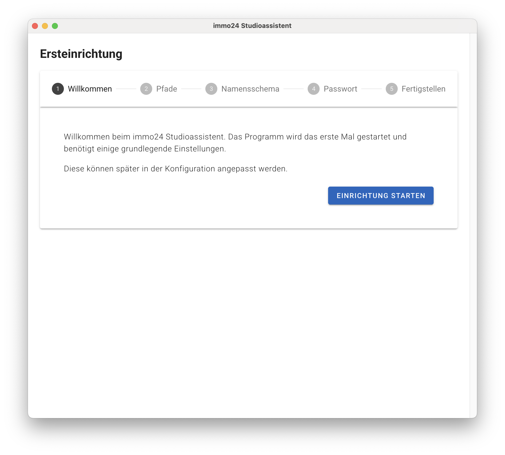
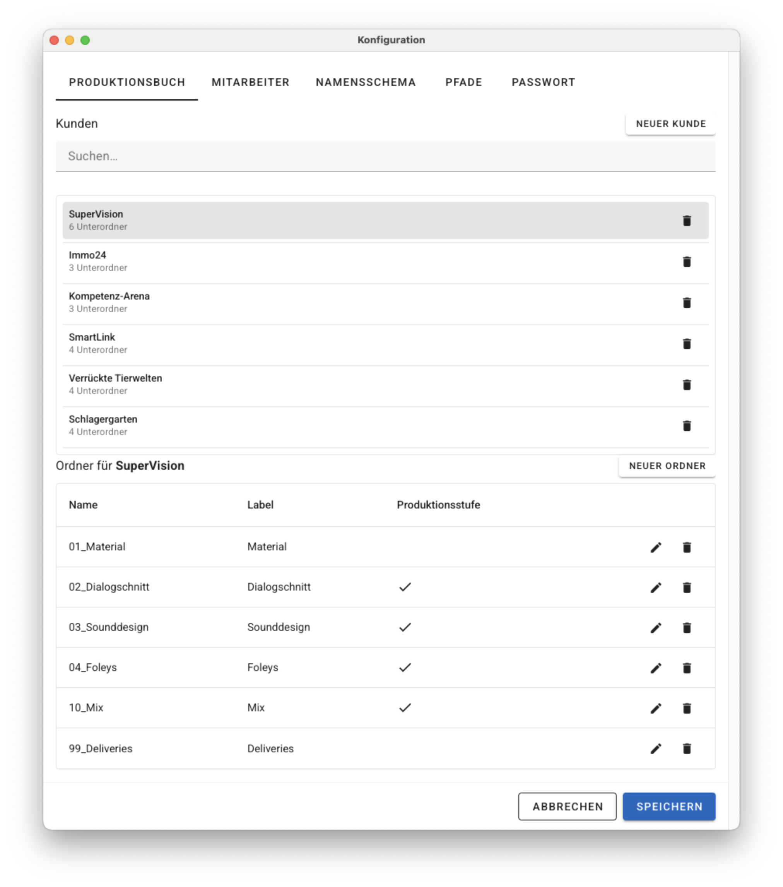
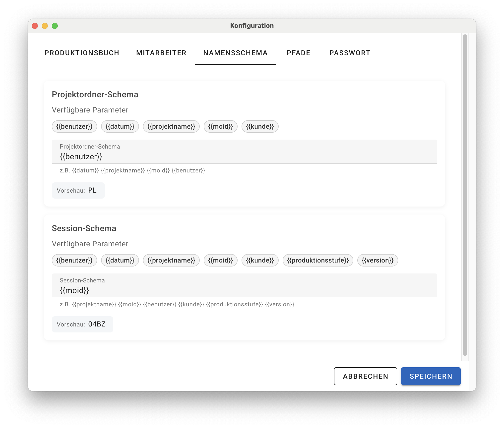
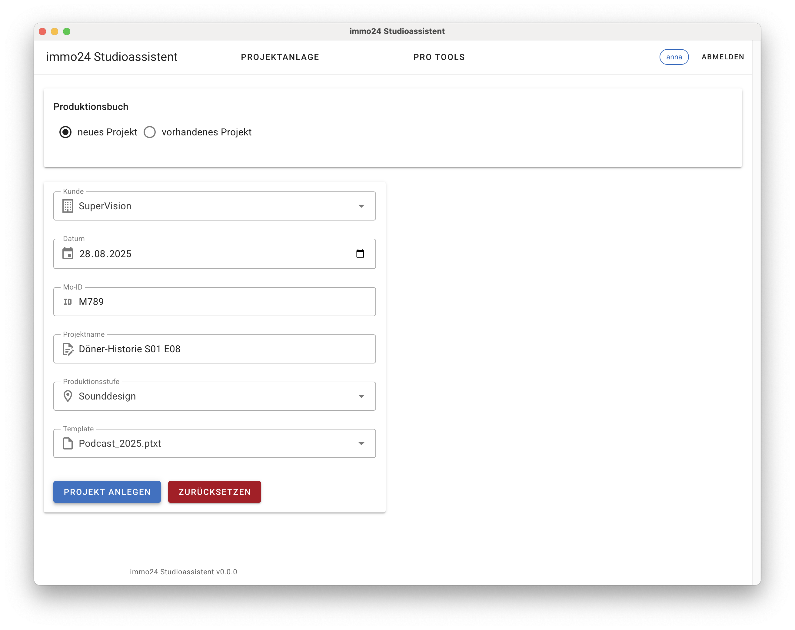
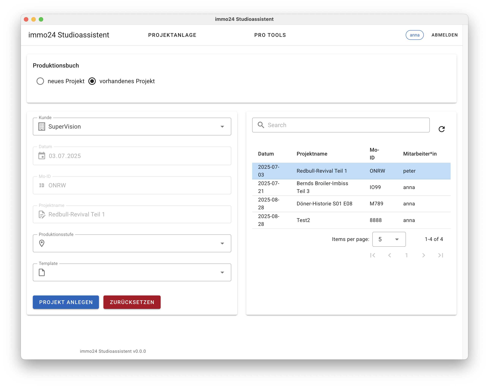
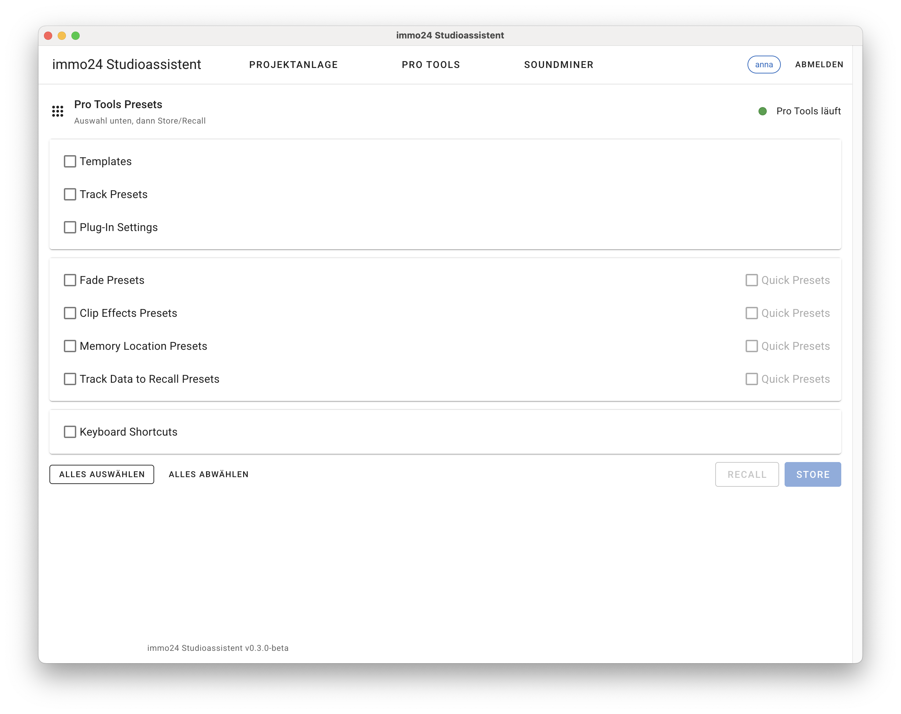

# immo24 Studioassistent

Der **immo24 Studioassistent** ist eine Desktop-Anwendung zur Verwaltung von Projekten und Presets auf vernetzten Avid Pro Tools Systemen.  

---

## 🚀 Features

- Projektanlage nach Namenskonventionen und Vorlagen  
- Automatische Verzeichnisstruktur mit Produktionsstufen  
- Speichern und Abrufen von Pro Tools Presets (Store/Recall)  
- Multi-User Funktionalität mit Benutzer-Login  
- Cross-Plattform (macOS & Windows)  

---

## 🧑‍💻 Ersteinrichtung

Beim ersten Start erscheint der **Einrichtungsassistent**.  
Er führt durch die grundlegenden Einstellungen, die später jederzeit im Konfigurationsmenü angepasst werden können.

---

## ⚙️ Konfiguration

Das Konfigurationsmenü öffnet man über:  
**Menüleiste → immo24 Studioassistent → Konfiguration**  
oder per Tastenkürzel: **CMD+,** (macOS) / **STRG+,** (Windows).  

> Die Konfiguration ist durch ein Passwort geschützt – Änderungen sollten mit Bedacht vorgenommen werden.

### Produktionsbuch
- Kunden-Stammdaten anlegen (jeder Kunde = Unterverzeichnis im Ordner `Produktionen`).  
- Projekte erhalten automatisch Unterordner wie z. B.:  

01_Material
02_Dialogschnitt
03_Sounddesign
04_Foleys
10_Mischung
99_Deliveries

- Unterordner-Eigenschaften: **Name**, **Label**, **Produktionsstufe**.  
- Produktionsstufen sind Ordner, in denen Pro Tools Sessions angelegt werden.  
- Jeder Kunde kann eine individuelle Struktur haben.

### Mitarbeiter
- Mitarbeiter = Unterverzeichnis im Ordner `Mitarbeiter`.  
- Jeder Mitarbeiter hat ein **Kürzel**, das bei Projekterstellung in Dateinamen verwendet wird.  
- Im Unterordner `immo24` werden alle projektrelevanten Daten gespeichert:  
- Kürzel (`immo24-user.json`)  
- Pro Tools Templates  
- Plug-In Settings  
- Restlicher Ordner bleibt frei für Backups & Testprojekte.

### Namensschema
- Projekte & Sessions folgen einem festen **Namensschema**.  
- Variablen + Freitext kombinierbar, Vorschau zeigt Beispielausgabe.  
- **Achtung:** Änderungen im laufenden Betrieb können bestehende Projekte unbrauchbar machen!

### Pfade
- **Mitarbeiter** → siehe *Mitarbeiter*  
- **Produktionen** → siehe *Produktionsbuch*  
- **Stammdaten** → Namensschema & Kundendaten (z. B. auf Netzlaufwerk für gemeinsame Nutzung)  
- **Pro Tools User** → typischerweise `/Users/<username>/Documents/Pro Tools` (macOS)

### Passwort
- Änderung des Passworts für das Konfigurationsmenü.

---

## 📂 Verwendung

### Login
Beim Start erscheint eine **Benutzer-Auswahl** (Dropdown aller Mitarbeiter).  
Nach Auswahl → „Anmelden“.  

---

### Modul: Projektanlage

Über das Eingabeformular können Projekte und Sessions angelegt werden.  
Unterschieden wird zwischen **Neuem Projekt** und **Vorhandenem Projekt**.

#### Neues Projekt
Formularfelder:
- **Kunde** → aus Konfiguration  
- **Datum** → Standard = aktuelles Datum  
- **Mo-ID** → eindeutige vierstellige ID  
- **Projektname** → Klarname/Arbeitstitel  
- **Produktionsstufe** → legt Session-Ordner fest  
- **Template** → Vorlagen aus `Mitarbeiter/<Name>/immo24/templates/*.ptxt`  

Aktionen:
- **Projekt anlegen** → erstellt Ordner, Unterordner, Session + Metadatei `immo24-proj.json`  
- **Zurücksetzen** → Formular löschen  

#### Vorhandenes Projekt
- Rechts: Liste vorhandener Projekte (nur mit `immo24-proj.json`).  
- Filter & Refresh möglich.  
- Formularfelder teilweise gesperrt.  
- Neue Sessions können in bestehenden Projekten erzeugt werden.  
- Gleiche Produktionsstufe → automatische Versionsnummer.  

---

### Modul: Pro Tools

Über das **Pro Tools Modul** können individuelle Presets und Templates zwischen einem zentralen Speicherort und dem lokalen Pro Tools-Verzeichnis synchronisiert werden.  

Aktionen:
- **Store** → lokale Files → zentraler Mitarbeiter-Ordner  
- **Recall** → zentrale Files → lokales Pro Tools-Verzeichnis  

> Hinweis: Einige Presets nur synchronisieren, wenn Pro Tools geschlossen ist.  

Gespeicherte Daten liegen in:  
`Mitarbeiter/<Name>/immo24`

---

### Abmelden
- Über „Abmelden“ den Benutzer wechseln.  
- Alternativ: Anwendung schließen.

---

## 💻 Systemanforderungen

- Enthält eigene **Node.js-Runtime**  
- Node-RED läuft standardmäßig auf **Port 1880**  
- Updates können einfach installiert werden, Konfiguration bleibt erhalten  

---

## 🛡️ Lizenz

Der **immo24 Studioassistent** steht unter der  
[GNU Affero General Public License v3.0 (AGPL-3.0)](./LICENSE).  

- Frei nutzbar unter AGPL-Bedingungen  
- Änderungen und Forks müssen ebenfalls unter AGPL veröffentlicht werden  
- Betrieb als Service löst ebenfalls Offenlegungspflicht aus  

👉 Drittanbieter-Lizenzen: siehe [LICENSES/](./LICENSES)  
👉 Marken: siehe [TRADEMARKS.md](./TRADEMARKS.md)

---